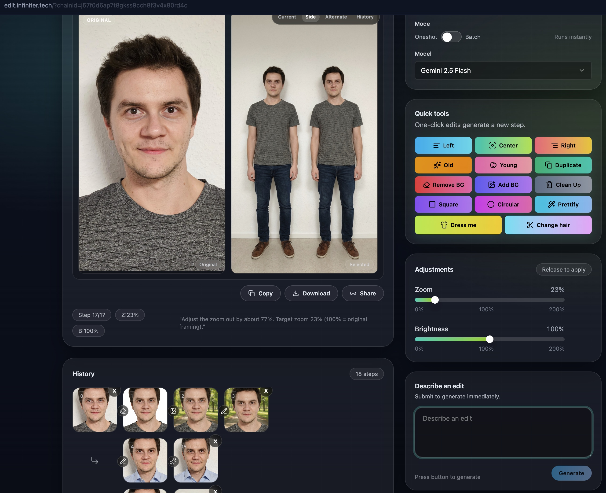

# Image Editing App

Small idea I had: "What if we could make image editor app that uses 0 math, 0 manual edits and everything is done with AI image gen?". Even brightness, crop, everything. Everything in ui just builds prompt that is sent to AI model and it builds tree structure of edits you can walk through to see how image changed.

